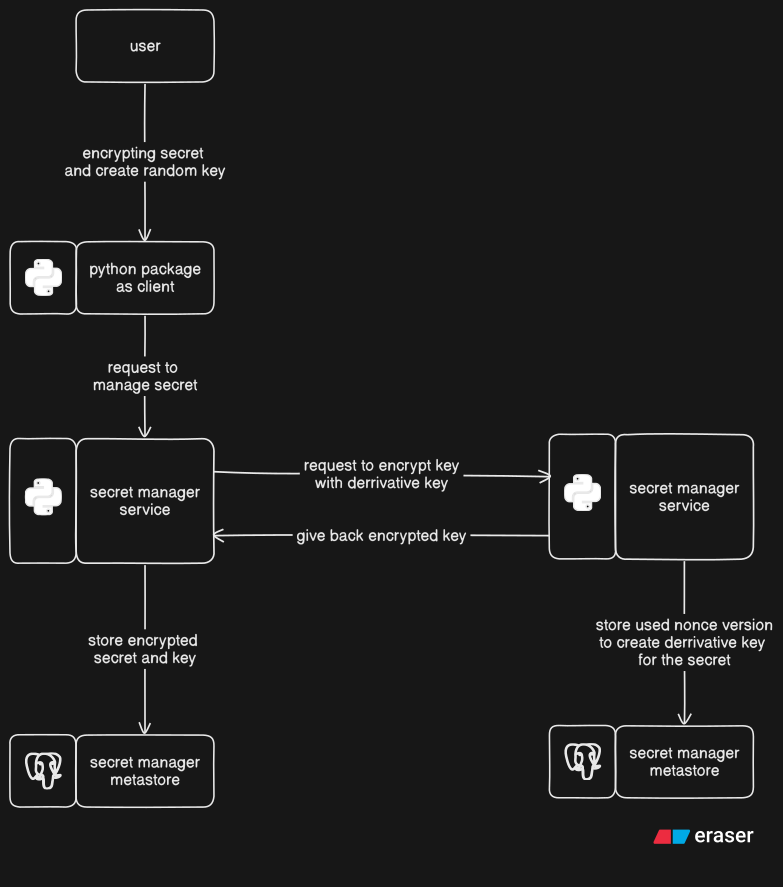

# Secret Vault

---

This project will give you a simple secret vault for storing database credential secured with AES-GCM encryption method and HKDF method for key derrivation.

The core concept of this project is creating a triple layer protection in this order:

- the secret get encrypted with AES-GCM method using a auto-generated key
- the key get encrypted with AES-GCM method using a derrivative key
- the derrivative key produced by HKDF method using a master key

For the detailed process will be described on the graph below

This project consist of multiple repositories listen on below:

## [Infrastucture as Code](https://github.com/willyyeremi/sv-iac)

This repository will create needed backend for this project to run (mainly database)

## [Secret Manager](https://github.com/willyyeremi/sv-secret-manager)

This project contain REST API to manage the secrets

## [Key Derivation Manager](https://github.com/willyyeremi/sv-key-derivation-manager)

This project contain REST API to manage derrivative key versioning for each secrets

## [Package for client](https://github.com/willyyeremi/sv-secret-manager-client)

This project contain python package source code to communicate with Secret Manager
